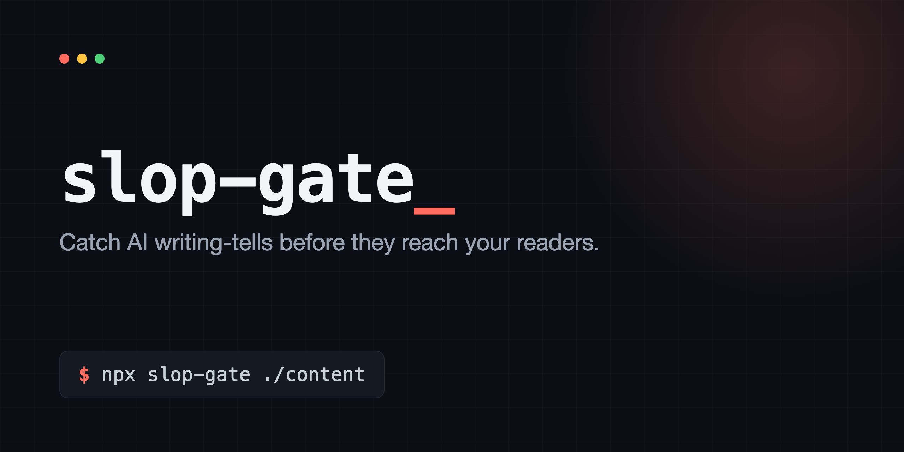

<p align="center">
  
</p>

<p align="center">
  
  
  
  
  
</p>

# slop-gate

Catch AI writing-tells before they reach your readers.

slop-gate scans your prose for the patterns that mark writing as machine-generated: the em-dash, "leverage," "delve into," "a testament to," and the rest. It flags them while you can still fix them, on your machine or in CI, so the tells never ship. A style rule in a document is a suggestion you can skip. This is that rule made automatic.

**Before**, an AI first draft (eight tells in two sentences):

> In today's fast-paced world, we are excited to delve into a robust, seamless solution that will empower your team — and unlock a whole new tapestry of possibilities. Feel free to reach out.

**After**, once slop-gate flags them and a person rewrites:

> Our new dashboard cuts your weekly report from two hours to ten minutes. Questions? Email us.

slop-gate finds the tells. You write the fix.

## The tells are not only English

Humanizers like QuillBot and Undetectable AI are built for English. But in Korean, Russian, Vietnamese, and Chinese, the fingerprint of AI-drafted or machine-translated text is *translationese*: stiff English calques a native writer would never reach for. An English-only linter is blind to all of it.

slop-gate ships a pack per language, so the same check that flags "delve" in English flags `의 경우` in Korean. The Korean pack catches the 번역투 tells: `의 경우` (a calque of "in the case of"), `따라서` used as a written "therefore," the vague `~을 통해`, mechanical `첫째·둘째·셋째` lists, and the hedging `~것으로 보인다` that machine-translated news leans on.

**Before**, machine-translated Korean (five tells in three sentences):

> 외국인등록증의 경우 신청 절차가 복잡합니다. 따라서 미리 준비하는 것이 좋습니다. 또한 신청서를 통해 정보를 제출함으로써 처리가 진행됩니다.

**After**, plain Korean a person writes:

> 외국인등록증은 신청 절차가 복잡해요. 그러니 미리 준비하는 게 좋아요. 신청서에 정보를 넣어서 제출하면 처리가 시작돼요.

Language packs are off by default. Turn on the ones you publish in:

```json
{ "rules": ["punctuation", "vocabulary", "korean"] }
```

The `korean`, `russian`, `vietnamese`, and `chinese` packs all ship today; each catches its own language's translationese.

## The Problem

Large language models leave fingerprints. A handful of words and one punctuation mark show up far more often in AI-drafted text than in anything a person writes unprompted: the em-dash, "leverage," "delve into," "in today's fast-paced world," "a testament to." Readers have learned to spot them. The moment they do, your content reads as low-effort, and trust drops, even when the substance is fine.

Code review catches broken code before it ships. Nothing catches this. So teams write a style rule in a doc, and the rule gets ignored, because a guideline you can skip is a guideline you will skip.

## Use cases

Anywhere prose ships and you want it to read like a person wrote it:

- **Docs and marketing sites** where AI drafts the first pass and the tells survive into production.
- **Blogs and newsletters** that publish often and cannot eyeball every paragraph.
- **Anything translated or multi-author**, where one contributor's AI habit quietly becomes the house style.
- **Teams with a style rule nobody enforces**, who want the rule enforced on every change instead of living in a wiki.

## Demo

Point it at a file with the usual tells:

```text
$ npx slop-gate examples/sample.md
examples/sample.md:3:1  In today's fast-paced world
  fast-paced-world: Delete it. Start with the subject.
examples/sample.md:3:48  delve
  delve: Use 'look at', 'go into', or 'cover'.
examples/sample.md:3:61  robust
  robust: Name the specific strength.
examples/sample.md:3:69  seamless
  seamless: Describe what actually works without friction.
examples/sample.md:4:20  empower
  empower: Say what the reader can now do.
examples/sample.md:4:38  —
  em-dash: The em-dash is the single most common AI-writing tell. Use a comma, a colon, or split the sentence.
examples/sample.md:4:44  unlock
  unlock: Say what becomes available.
examples/sample.md:4:63  tapestry
  tapestry: A classic AI tell. Be literal about what is there.

slop-gate: 11 tells in 1 file. Fix these before publishing.
```

Exit code is 1, so a CI job stops here until the tells are gone.

## Quick Start

```bash
# Run it once, no install:
npx slop-gate ./content

# Or add it to a project:
npm install --save-dev slop-gate
npx slop-gate ./content
```

Add it to CI so it runs on every pull request:

```yaml
# .github/workflows/prose.yml
name: prose
on: [pull_request]
jobs:
  slop-gate:
    runs-on: ubuntu-latest
    steps:
      - uses: actions/checkout@v4
      - uses: actions/setup-node@v4
        with:
          node-version: 20
      - run: npx slop-gate ./content
```

## How It Works

You point it at your text. It reads each file line by line and checks every line against two lists: a punctuation list (the em-dash) and a vocabulary list (the words and phrases that read as machine-generated). When a line matches, it prints the file, the line, the column, the exact text it found, and a one-line hint for what to do instead. If it found anything, it exits 1.

That is the whole tool. No model, no network, no scoring. The lists are plain JSON you can read and edit.

## Configuration

Drop a `slop-gate.config.json` in your project root, or pass paths on the command line. With no config, it scans `**/*.md`, `**/*.mdx`, and `**/*.txt` with the `punctuation` and `vocabulary` packs on. Language packs like `korean` are off by default; add them to `rules` to turn them on.

```json
{
  "include": ["**/*.md", "**/*.mdx"],
  "exclude": ["node_modules/**", "CHANGELOG.md"],
  "rules": ["punctuation", "vocabulary"],
  "allow": [
    {
      "paths": ["content/de/**", "content/ru/**"],
      "rules": ["em-dash"]
    }
  ]
}
```

- **`include` / `exclude`** are globs (`**` for any depth, `*` for one path segment).
- **`rules`** lists which built-in packs to load.
- **`allow`** turns specific rules off for specific paths. The example above keeps the em-dash banned everywhere except the German and Russian content, where it is correct grammar. You can allowlist a whole pack by id, or a single rule by id.

To skip one line on purpose, put `slop-gate-ignore` anywhere on it.

## The rule packs

Six packs ship in [`rules/`](rules), as plain JSON. The English packs are on by default; the language packs are opt-in:

- **`punctuation`** flags the em-dash, the single most common AI tell.
- **`vocabulary`** flags around forty English words and phrases, including `delve`, `leverage`, `seamless`, `robust`, `tapestry`, `a testament to`, `in today's fast-paced world`, `feel free to`, and `at the end of the day`. Each one carries a hint for what to write instead.
- **`korean`** flags 번역투 (translationese): the English calques and stiff written-register phrases that mark Korean text as AI-drafted or machine-translated.
- **`russian`** flags канцелярит (bureaucratic Russian): the copula `является`, split-predicate verbs like `осуществить`, and ministry set-phrases.
- **`vietnamese`** flags Hán-Việt overuse and calque connectors: `thực hiện`, `trong trường hợp`, `tuy nhiên`.
- **`chinese`** flags 公文腔 (officialese): `进行`+noun padding, `予以`, `按照规定`, and stock openers like `众所周知`.

Each rule carries a bilingual hint, the English reason plus the native-language fix. Turn a language pack on by adding it to `rules`, e.g. `"rules": ["punctuation", "vocabulary", "korean"]`.

A rule is just an id, a pattern, and a hint:

```json
{ "id": "leverage", "match": "\\bleverage\\b", "hint": "Use 'use' or 'take advantage of'." }
```

Edit a pack to fit your house style, or add your own. The lists are the product, and they are meant to be read.

## Where the tells come from

The lists are not guesses. They track documented phenomena, and you can read every entry and the reason behind it.

**The English tells track measured LLM word-frequency shifts.** Large studies of post-ChatGPT writing found a sudden rise in a specific set of words. [Liang et al. (*Nature Human Behaviour*, 2025)](https://www.nature.com/articles/s41562-025-02273-8) analysed over a million papers and flagged "realm," "intricate," "showcasing," and "pivotal" as words that were flat for a decade, then surged from 2023. A [2025 *Science Advances* study](https://pmc.ncbi.nlm.nih.gov/articles/PMC12219543/) of 15 million biomedical abstracts found the same excess-vocabulary signal; "delve" alone rose about 1,500% between 2022 and 2024. The `vocabulary` pack flags those exact words.

**The translationese packs track named linguistic phenomena.** In each language, machine-drafted text carries the fingerprint of its source-language calques, and each language already has a name and an editorial tradition for it:

- **Russian** — канцелярит, the bureaucratic register Kornei Chukovsky called the central disease of the language, and the target of Maxim Ilyakhov's standard plain-writing guide *Пиши, сокращай*.
- **Korean** — 번역투, the translationese studied in Korean translation scholarship.
- **Chinese** — 公文腔, the officialese register of government documents.
- **Vietnamese** — Hán-Việt overuse, leaning on Sino-Vietnamese vocabulary where plain native words are simpler.

The tool does not score or detect authorship; it flags the specific, documented patterns above so you can decide. Which entries make the list is an editorial call, but the categories are not invented.

## Design Decisions

**Enforced, not advised.** The point of the tool is the exit code. A rule in a wiki is advice; a non-zero exit is a stop sign. Everything else here exists to make that stop sign trustworthy enough to leave on.

**Word lists, not a model.** It would be possible to ask an AI "does this read as AI-written?" That is slow, costs money on every check, gives a different answer each run, and cannot tell you which word to change. A fixed list is instant, free, identical every time, and points at the exact token. The catch is that it only catches what is on the list, so the list is the thing worth maintaining. That is a feature: you can read it.

**It is not a detector.** This does not judge whether text was written by a machine. A person can trip every rule and a model can avoid them all. It flags specific patterns you chose to ban. Pretending to detect AI authorship would be a lie the tool cannot back up.

**Allowlist by path, because a tell in one language is grammar in another.** The em-dash is a tell in English marketing copy and correct punctuation in German or Russian. A global ban would force you to mangle the languages that use it. So rules turn off per path, and the rest of your text stays protected.

**Zero dependencies.** A check you add to CI should not pull in a tree of packages that themselves need watching. It is one file of Node and two JSON lists. It runs anywhere Node 18 runs, offline.

**It flags, you decide.** It points at the line and suggests a fix, but it does not rewrite your sentence. The right replacement for "leverage" depends on what you meant, and that is your call, not the tool's.

## What It Does Not Do

- It does not detect AI authorship. It flags patterns, not provenance.
- It does not rewrite your text. It shows you the line; the edit is yours.
- It does not understand context. "Robust" is fine in a statistics paper. Allowlist the rule for that path, or ignore the line.
- It does not check grammar, spelling, or readability. Use a real linter for those. This does one narrow thing.

## Roadmap

- `--fix` for the few swaps that are safe without judgment.
- SARIF output, so findings show up in GitHub code scanning.
- More language packs, and more English packs: corporate filler, hedging, bureaucratic carry-over.

## Contributing

The rule packs are the product, so the highest-value contribution is a tell. If a word or phrase reads as machine-generated to you and it is not on the list, open a pull request adding it to [`rules/vocabulary.json`](rules/vocabulary.json):

```json
{ "id": "elevate", "match": "\\belevate\\b", "hint": "Say what actually improves." }
```

One id, one pattern, one hint for what to write instead. False positives and bug reports are just as welcome: open an issue with the line that tripped.

## License

[MIT](LICENSE)
